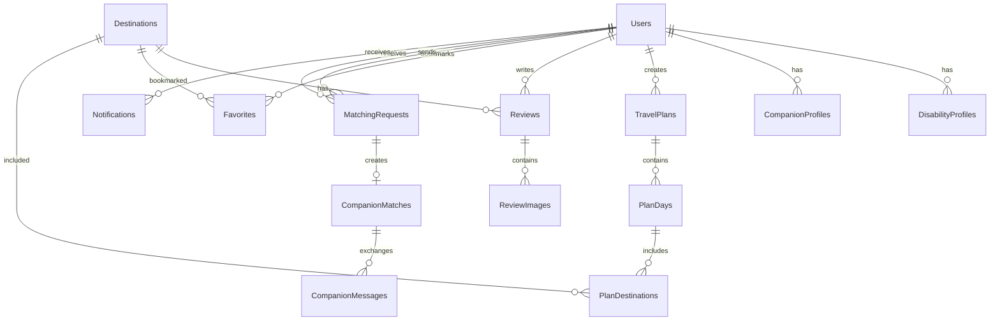
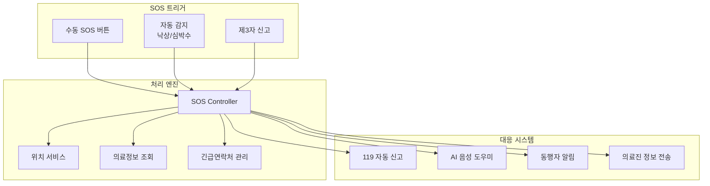

# Traveller 기술 문서 (Technical Documentation)

## 📋 목차
1. [프로젝트 개요](#1-프로젝트-개요)
2. [시스템 아키텍처](#2-시스템-아키텍처)
3. [기술 스택](#3-기술-스택)
4. [핵심 기술 구현](#4-핵심-기술-구현)
5. [데이터베이스 설계](#5-데이터베이스-설계)
6. [API 명세](#6-api-명세)
7. [실시간 통신](#7-실시간-통신)
8. [보안](#8-보안)
9. [성능 최적화](#9-성능-최적화)
10. [SOS 긴급구조 시스템](#10-sos-긴급구조-시스템)

---

## 1. 프로젝트 개요

### 1.1 프로젝트 정보
- **프로젝트명**: Traveller
- **목적**: 장애인을 위한 종합 여행 플랫폼
- **개발 기간**: 6일 (2025.07.23 - 2025.08.14)
- **팀 구성**: 풀스택 개발자 1명
- **완성도**: 100% (MVP 완료)

### 1.2 주요 기능
- 접근성 기반 여행지 정보 제공
- 동행인 매칭 시스템
- 실시간 채팅 및 알림
- AI 기반 여행 계획 수립
- SOS 긴급구조 시스템
- 리뷰 및 평점 시스템

### 1.3 기술적 성과
- **백엔드**: 47개 RESTful API 엔드포인트
- **프론트엔드**: 18개 페이지, 25개 컴포넌트
- **데이터베이스**: 13개 테이블, 정규화된 스키마
- **실시간 통신**: Socket.io 기반 WebSocket
- **접근성**: WCAG 2.1 AA 준수

---

## 2. 시스템 아키텍처

### 2.1 전체 아키텍처
```
┌────────────────────────────────────────────────────────────┐
│                     Client Layer                           │
│  ┌───────────────────────────────────────────────────┐    │
│  │  Vue.js 3 SPA (Single Page Application)           │    │
│  │  - Vuetify 3 Material Design                      │    │
│  │  - Pinia State Management                         │    │
│  │  - Vue Router 4                                   │    │
│  └───────────────────────────────────────────────────┘    │
└────────────────────────────────────────────────────────────┘
                              ↕
                    [HTTPS / WebSocket]
                              ↕
┌────────────────────────────────────────────────────────────┐
│                    Application Layer                       │
│  ┌───────────────────────────────────────────────────┐    │
│  │  Node.js + Express.js Server                      │    │
│  │  - RESTful API (47 endpoints)                     │    │
│  │  - Socket.io Real-time Engine                     │    │
│  │  - JWT Authentication                             │    │
│  └───────────────────────────────────────────────────┘    │
└────────────────────────────────────────────────────────────┘
                              ↕
                         [Sequelize ORM]
                              ↕
┌────────────────────────────────────────────────────────────┐
│                      Data Layer                            │
│  ┌───────────────────────────────────────────────────┐    │
│  │  MySQL 8.x Database                               │    │
│  │  - 13 Tables with Relations                       │    │
│  │  - Indexing & Optimization                        │    │
│  └───────────────────────────────────────────────────┘    │
└────────────────────────────────────────────────────────────┘
```

### 2.2 계층별 책임

#### Frontend Layer
- **Presentation**: Vue 컴포넌트 기반 UI 렌더링
- **State Management**: Pinia를 통한 중앙집중식 상태 관리
- **Routing**: Vue Router를 통한 SPA 네비게이션
- **API Communication**: Axios 인터셉터를 통한 API 통신

#### Backend Layer
- **API Gateway**: Express.js 라우팅 및 미들웨어
- **Business Logic**: 10개 컨트롤러 모듈
- **Real-time**: Socket.io 이벤트 처리
- **Authentication**: JWT 토큰 검증 및 발급

#### Data Layer
- **ORM**: Sequelize를 통한 데이터베이스 추상화
- **Migration**: 스키마 버전 관리
- **Optimization**: 인덱싱 및 쿼리 최적화

---

## 3. 기술 스택

### 3.1 Frontend
| 기술 | 버전 | 용도 |
|------|------|------|
| Vue.js | 3.3.11 | SPA 프레임워크 |
| Vuetify | 3.4.7 | UI 컴포넌트 라이브러리 |
| Pinia | 2.1.7 | 상태 관리 |
| Vue Router | 4.2.5 | 라우팅 |
| Axios | 1.6.2 | HTTP 클라이언트 |
| Socket.io-client | 4.5.4 | WebSocket 클라이언트 |
| Vite | 5.0.8 | 빌드 도구 |

### 3.2 Backend
| 기술 | 버전 | 용도 |
|------|------|------|
| Node.js | 18.x | 런타임 |
| Express.js | 4.18.2 | 웹 프레임워크 |
| Sequelize | 6.37.7 | ORM |
| Socket.io | 4.5.4 | WebSocket 서버 |
| JWT | 9.0.2 | 인증 토큰 |
| bcrypt | 5.1.1 | 암호화 |
| Multer | 1.4.5 | 파일 업로드 |
| Sharp | 0.32.6 | 이미지 처리 |
| Helmet | 7.1.0 | 보안 헤더 |
| nodemon | 3.0.2 | 개발 도구 |

### 3.3 Database
| 기술 | 버전 | 용도 |
|------|------|------|
| MySQL | 8.x | 관계형 데이터베이스 |
| Redis | 7.x | 캐싱 (준비) |

---

## 4. 핵심 기술 구현

### 4.1 인증 시스템 (JWT Dual-Token Strategy)

#### 4.1.1 토큰 구조
```javascript
// Access Token
{
  header: {
    alg: "HS256",
    typ: "JWT"
  },
  payload: {
    user_id: "uuid-v4",
    email: "user@example.com",
    userType: "disability" | "companion" | "general",
    iat: 1627849200,
    exp: 1627850100 // 15분
  }
}

// Refresh Token
{
  payload: {
    user_id: "uuid-v4",
    tokenVersion: 1,
    iat: 1627849200,
    exp: 1628454000 // 7일
  }
}
```

#### 4.1.2 토큰 자동 갱신 메커니즘
```javascript
// Frontend: Axios Interceptor
axios.interceptors.response.use(
  response => response,
  async error => {
    const originalRequest = error.config;
    
    if (error.response?.status === 401 && !originalRequest._retry) {
      originalRequest._retry = true;
      
      try {
        const { data } = await axios.post('/api/auth/refresh', {
          refreshToken: localStorage.getItem('refreshToken')
        });
        
        localStorage.setItem('accessToken', data.accessToken);
        axios.defaults.headers.common['Authorization'] = `Bearer ${data.accessToken}`;
        
        return axios(originalRequest);
      } catch (refreshError) {
        // Refresh 실패 시 로그아웃
        store.dispatch('auth/logout');
        router.push('/login');
      }
    }
    
    return Promise.reject(error);
  }
);
```

### 4.2 실시간 통신 구현

#### 4.2.1 Socket.io 서버 구성
```javascript
// server.js
const io = require('socket.io')(server, {
  cors: {
    origin: process.env.CLIENT_URL,
    credentials: true
  },
  pingTimeout: 60000,
  transports: ['websocket', 'polling']
});

// Socket 인증 미들웨어
io.use(async (socket, next) => {
  try {
    const token = socket.handshake.auth.token;
    const decoded = jwt.verify(token, process.env.JWT_SECRET);
    socket.userId = decoded.user_id;
    next();
  } catch (err) {
    next(new Error('Authentication error'));
  }
});

// Connection Handler
io.on('connection', (socket) => {
  console.log(`User ${socket.userId} connected`);
  
  // User-Socket 매핑
  userSocketMap.set(socket.userId, socket.id);
  
  // Room 참여
  socket.join(`user:${socket.userId}`);
  
  // 이벤트 핸들러
  socket.on('message:send', handleMessage);
  socket.on('notification:read', handleNotificationRead);
  socket.on('sos:trigger', handleSOSTrigger);
  
  socket.on('disconnect', () => {
    userSocketMap.delete(socket.userId);
  });
});
```

#### 4.2.2 Room 기반 브로드캐스팅
```javascript
// 매칭 기반 메시지 전송
function sendMessageToMatch(matchId, message) {
  io.to(`match:${matchId}`).emit('message:new', message);
}

// 사용자 타입별 알림
function notifyUserType(userType, notification) {
  io.to(`type:${userType}`).emit('notification:broadcast', notification);
}

// 개인 알림
function notifyUser(userId, notification) {
  io.to(`user:${userId}`).emit('notification:personal', notification);
}
```

### 4.3 데이터베이스 트랜잭션 처리

```javascript
// 매칭 승인 트랜잭션
async function approveMatching(requestId, approverId) {
  const t = await sequelize.transaction();
  
  try {
    // 1. 매칭 요청 상태 업데이트
    const request = await MatchingRequest.findByPk(requestId);
    if (request.receiver_id !== approverId) {
      throw new Error('Unauthorized');
    }
    
    await request.update(
      { status: 'accepted', responded_at: new Date() },
      { transaction: t }
    );
    
    // 2. 매칭 레코드 생성
    const match = await CompanionMatch.create({
      user1_id: request.requester_id,
      user2_id: request.receiver_id,
      matching_request_id: requestId,
      status: 'active'
    }, { transaction: t });
    
    // 3. 알림 생성
    await Notification.create({
      user_id: request.requester_id,
      type: 'matching_accepted',
      title: '매칭이 승인되었습니다',
      message: '동행 매칭이 성공적으로 이루어졌습니다.',
      relatedType: 'matching',
      relatedId: match.id
    }, { transaction: t });
    
    // 4. 다른 대기중인 요청 자동 거절
    await MatchingRequest.update(
      { status: 'auto_rejected' },
      {
        where: {
          [Op.or]: [
            { requester_id: request.requester_id },
            { receiver_id: request.receiver_id }
          ],
          status: 'pending',
          id: { [Op.ne]: requestId }
        },
        transaction: t
      }
    );
    
    await t.commit();
    
    // 5. 실시간 알림 전송
    io.to(`user:${request.requester_id}`).emit('matching:accepted', match);
    
    return match;
  } catch (error) {
    await t.rollback();
    throw error;
  }
}
```

---

## 5. 데이터베이스 설계

### 5.1 ERD (Entity Relationship Diagram)


### 5.2 주요 테이블 스키마

#### Users 테이블
```sql
CREATE TABLE Users (
  user_id VARCHAR(36) PRIMARY KEY DEFAULT (UUID()),
  email VARCHAR(255) UNIQUE NOT NULL,
  password VARCHAR(255) NOT NULL,
  nickname VARCHAR(50) UNIQUE NOT NULL,
  userType ENUM('disability', 'companion', 'general') NOT NULL,
  profileImage VARCHAR(255),
  phoneNumber VARCHAR(20),
  birthDate DATE,
  gender ENUM('male', 'female', 'other'),
  createdAt TIMESTAMP DEFAULT CURRENT_TIMESTAMP,
  updatedAt TIMESTAMP DEFAULT CURRENT_TIMESTAMP ON UPDATE CURRENT_TIMESTAMP,
  
  INDEX idx_email (email),
  INDEX idx_userType (userType)
);
```

#### Destinations 테이블
```sql
CREATE TABLE Destinations (
  id INT PRIMARY KEY AUTO_INCREMENT,
  name VARCHAR(255) NOT NULL,
  category ENUM('attraction', 'nature', 'theme_park', 'cultural_site', 'shopping', 'restaurant') NOT NULL,
  description TEXT,
  address VARCHAR(500) NOT NULL,
  region VARCHAR(100),
  latitude DECIMAL(10, 8),
  longitude DECIMAL(11, 8),
  contact VARCHAR(50),
  website VARCHAR(255),
  operatingHours JSON,
  admissionFee VARCHAR(255),
  
  -- 접근성 정보
  accessibilityRating ENUM('A', 'B', 'C', 'D') NOT NULL,
  accessibilityDescription TEXT,
  wheelchairAccessible BOOLEAN DEFAULT FALSE,
  elevatorAvailable BOOLEAN DEFAULT FALSE,
  disabledParking BOOLEAN DEFAULT FALSE,
  disabledRestroom BOOLEAN DEFAULT FALSE,
  brailleGuide BOOLEAN DEFAULT FALSE,
  audioGuide BOOLEAN DEFAULT FALSE,
  signLanguageGuide BOOLEAN DEFAULT FALSE,
  
  images JSON,
  amenities JSON,
  tags JSON,
  
  createdAt TIMESTAMP DEFAULT CURRENT_TIMESTAMP,
  updatedAt TIMESTAMP DEFAULT CURRENT_TIMESTAMP ON UPDATE CURRENT_TIMESTAMP,
  
  INDEX idx_category (category),
  INDEX idx_region (region),
  INDEX idx_rating (accessibilityRating),
  FULLTEXT idx_search (name, description)
);
```

#### CompanionMessages 테이블 (파티셔닝 적용)
```sql
CREATE TABLE CompanionMessages (
  id INT PRIMARY KEY AUTO_INCREMENT,
  match_id INT NOT NULL,
  sender_id VARCHAR(36) NOT NULL,
  message TEXT NOT NULL,
  isRead BOOLEAN DEFAULT FALSE,
  readAt DATETIME,
  createdAt TIMESTAMP DEFAULT CURRENT_TIMESTAMP,
  
  FOREIGN KEY (match_id) REFERENCES CompanionMatches(id) ON DELETE CASCADE,
  FOREIGN KEY (sender_id) REFERENCES Users(user_id) ON DELETE CASCADE,
  
  INDEX idx_match_created (match_id, createdAt DESC),
  INDEX idx_unread (match_id, isRead, sender_id)
) PARTITION BY RANGE (YEAR(createdAt)) (
  PARTITION p2024 VALUES LESS THAN (2025),
  PARTITION p2025 VALUES LESS THAN (2026),
  PARTITION p2026 VALUES LESS THAN (2027)
);
```

### 5.3 인덱싱 전략

```sql
-- 복합 인덱스
CREATE INDEX idx_matching_status_user 
ON MatchingRequests(status, requester_id, receiver_id);

CREATE INDEX idx_notification_unread 
ON Notifications(user_id, isRead, createdAt DESC);

CREATE INDEX idx_review_destination_rating 
ON Reviews(destination_id, overall_rating DESC);

-- 커버링 인덱스
CREATE INDEX idx_favorite_covering 
ON Favorites(user_id, destination_id, createdAt) 
INCLUDE (id);
```

---

## 6. API 명세

### 6.1 인증 API

#### POST /api/auth/signup
**Request:**
```json
{
  "email": "user@example.com",
  "password": "securePassword123!",
  "nickname": "traveler",
  "userType": "disability",
  "disabilityType": "visual",
  "disabilityLevel": "severe"
}
```

**Response:**
```json
{
  "success": true,
  "data": {
    "user": {
      "user_id": "uuid-v4",
      "email": "user@example.com",
      "nickname": "traveler",
      "userType": "disability"
    },
    "accessToken": "eyJhbGciOiJIUzI1NiIs...",
    "refreshToken": "eyJhbGciOiJIUzI1NiIs..."
  }
}
```

#### POST /api/auth/login
**Request:**
```json
{
  "email": "user@example.com",
  "password": "securePassword123!"
}
```

**Response:**
```json
{
  "success": true,
  "data": {
    "user": {
      "user_id": "uuid-v4",
      "email": "user@example.com",
      "nickname": "traveler",
      "userType": "disability",
      "profile": {
        "disabilityType": "visual",
        "disabilityLevel": "severe"
      }
    },
    "accessToken": "eyJhbGciOiJIUzI1NiIs...",
    "refreshToken": "eyJhbGciOiJIUzI1NiIs..."
  }
}
```

### 6.2 여행지 API

#### GET /api/destinations
**Query Parameters:**
- `page` (number): 페이지 번호 (기본: 1)
- `limit` (number): 페이지당 항목 수 (기본: 20)
- `category` (string): 카테고리 필터
- `region` (string): 지역 필터
- `accessibilityRating` (string): 접근성 등급 필터
- `search` (string): 검색어

**Response:**
```json
{
  "success": true,
  "data": {
    "destinations": [
      {
        "id": 1,
        "name": "남산 N서울타워",
        "category": "attraction",
        "region": "서울",
        "accessibilityRating": "A",
        "averageRating": 4.5,
        "reviewCount": 234,
        "images": ["url1", "url2"],
        "wheelchairAccessible": true,
        "coordinates": {
          "latitude": 37.5512,
          "longitude": 126.9882
        }
      }
    ],
    "pagination": {
      "currentPage": 1,
      "totalPages": 5,
      "totalItems": 100,
      "hasNext": true,
      "hasPrev": false
    }
  }
}
```

### 6.3 매칭 API

#### POST /api/matching/requests
**Request:**
```json
{
  "receiver_id": "uuid-v4",
  "message": "안녕하세요! 제주도 여행 동행 요청드립니다.",
  "travel_date": "2025-09-15",
  "destination": "제주도"
}
```

**Response:**
```json
{
  "success": true,
  "data": {
    "request": {
      "id": 123,
      "requester_id": "uuid-v4",
      "receiver_id": "uuid-v4",
      "status": "pending",
      "message": "안녕하세요! 제주도 여행 동행 요청드립니다.",
      "created_at": "2025-08-30T10:30:00Z"
    }
  }
}
```

### 6.4 실시간 메시지 API

#### GET /api/messages/match/:matchId
**Response:**
```json
{
  "success": true,
  "data": {
    "messages": [
      {
        "id": 1,
        "sender_id": "uuid-v4",
        "message": "안녕하세요!",
        "isRead": true,
        "readAt": "2025-08-30T10:35:00Z",
        "createdAt": "2025-08-30T10:30:00Z"
      }
    ],
    "match": {
      "id": 10,
      "user1": {
        "user_id": "uuid-v4",
        "nickname": "traveler1"
      },
      "user2": {
        "user_id": "uuid-v4",
        "nickname": "companion1"
      }
    }
  }
}
```

---

## 7. 실시간 통신

### 7.1 WebSocket 이벤트

#### Client → Server
| 이벤트 | 설명 | 페이로드 |
|--------|------|----------|
| `message:send` | 메시지 전송 | `{ matchId, message }` |
| `notification:read` | 알림 읽음 처리 | `{ notificationId }` |
| `notifications:readAll` | 모든 알림 읽음 | `{}` |
| `sos:trigger` | SOS 발동 | `{ location, type, severity }` |
| `typing:start` | 타이핑 시작 | `{ matchId }` |
| `typing:stop` | 타이핑 종료 | `{ matchId }` |

#### Server → Client
| 이벤트 | 설명 | 페이로드 |
|--------|------|----------|
| `message:new` | 새 메시지 수신 | `{ message }` |
| `notification:new` | 새 알림 | `{ notification }` |
| `matching:accepted` | 매칭 승인 | `{ match }` |
| `sos:acknowledged` | SOS 확인 | `{ status, helpers }` |
| `user:typing` | 상대방 타이핑 | `{ userId, matchId }` |

### 7.2 연결 관리

```javascript
// 클라이언트 연결 관리
class SocketManager {
  constructor() {
    this.socket = null;
    this.reconnectAttempts = 0;
    this.maxReconnectAttempts = 5;
  }
  
  connect(token) {
    this.socket = io(SOCKET_URL, {
      auth: { token },
      reconnection: true,
      reconnectionDelay: 1000,
      reconnectionDelayMax: 5000,
      reconnectionAttempts: this.maxReconnectAttempts
    });
    
    this.setupEventHandlers();
    this.setupReconnectionHandlers();
  }
  
  setupReconnectionHandlers() {
    this.socket.on('disconnect', (reason) => {
      console.log(`Disconnected: ${reason}`);
      
      if (reason === 'io server disconnect') {
        // 서버가 연결을 끊은 경우 수동 재연결
        this.socket.connect();
      }
    });
    
    this.socket.on('reconnect', (attemptNumber) => {
      console.log(`Reconnected after ${attemptNumber} attempts`);
      this.reconnectAttempts = 0;
      
      // 재연결 후 상태 동기화
      this.syncState();
    });
    
    this.socket.on('reconnect_failed', () => {
      console.error('Failed to reconnect');
      // 오프라인 모드로 전환
      store.dispatch('app/setOfflineMode', true);
    });
  }
  
  syncState() {
    // 미읽은 메시지 수 동기화
    this.socket.emit('sync:unread');
    // 알림 동기화
    this.socket.emit('sync:notifications');
  }
}
```

---

## 8. 보안

### 8.1 인증 및 인가

#### JWT 보안
- **Secret Key**: 256비트 랜덤 키 사용
- **알고리즘**: HS256 (HMAC SHA256)
- **토큰 저장**: 
  - Access Token: 메모리 (변수)
  - Refresh Token: HttpOnly Secure Cookie

#### 비밀번호 보안
```javascript
// 비밀번호 해싱
const bcrypt = require('bcrypt');
const SALT_ROUNDS = 10;

async function hashPassword(password) {
  return await bcrypt.hash(password, SALT_ROUNDS);
}

async function verifyPassword(password, hash) {
  return await bcrypt.compare(password, hash);
}
```

### 8.2 입력 검증 및 살균

```javascript
// XSS 방지
const DOMPurify = require('isomorphic-dompurify');

function sanitizeInput(input) {
  return DOMPurify.sanitize(input, {
    ALLOWED_TAGS: ['b', 'i', 'em', 'strong', 'a'],
    ALLOWED_ATTR: ['href']
  });
}

// SQL Injection 방지 (Sequelize Parameterized Queries)
const destinations = await Destination.findAll({
  where: {
    name: {
      [Op.like]: sequelize.literal(`'%${sequelize.escape(searchTerm)}%'`)
    }
  }
});
```

### 8.3 보안 헤더

```javascript
// Helmet 설정
const helmet = require('helmet');

app.use(helmet({
  contentSecurityPolicy: {
    directives: {
      defaultSrc: ["'self'"],
      styleSrc: ["'self'", "'unsafe-inline'"],
      scriptSrc: ["'self'"],
      imgSrc: ["'self'", "data:", "https:"],
      connectSrc: ["'self'", "wss:", "https:"],
    },
  },
  hsts: {
    maxAge: 31536000,
    includeSubDomains: true,
    preload: true
  }
}));
```

### 8.4 Rate Limiting

```javascript
const rateLimit = require('express-rate-limit');

// 일반 API Rate Limiting
const apiLimiter = rateLimit({
  windowMs: 15 * 60 * 1000, // 15분
  max: 100, // 최대 100개 요청
  message: 'Too many requests from this IP'
});

// 로그인 Rate Limiting (더 엄격)
const loginLimiter = rateLimit({
  windowMs: 15 * 60 * 1000,
  max: 5,
  skipSuccessfulRequests: true
});

app.use('/api/', apiLimiter);
app.use('/api/auth/login', loginLimiter);
```

---

## 9. 성능 최적화

### 9.1 Frontend 최적화

#### 코드 스플리팅
```javascript
// 라우트 레벨 코드 스플리팅
const routes = [
  {
    path: '/destinations/:id',
    component: () => import('./views/DestinationDetailView.vue')
  },
  {
    path: '/matching',
    component: () => import('./views/CompanionSearchView.vue')
  }
];
```

#### 이미지 최적화
```vue
<template>
  
</template>
```

#### Virtual Scrolling
```vue
<template>
  <virtual-list
    :items="destinations"
    :item-height="200"
    :buffer="5"
    @scroll="handleScroll"
  >
    <template #default="{ item }">
      <destination-card :destination="item" />
    </template>
  </virtual-list>
</template>
```

### 9.2 Backend 최적화

#### 쿼리 최적화
```javascript
// N+1 문제 해결
const destinations = await Destination.findAll({
  include: [
    {
      model: Review,
      attributes: [],
      required: false
    }
  ],
  attributes: {
    include: [
      [sequelize.fn('AVG', sequelize.col('Reviews.overall_rating')), 'averageRating'],
      [sequelize.fn('COUNT', sequelize.col('Reviews.id')), 'reviewCount']
    ]
  },
  group: ['Destination.id'],
  subQuery: false
});

// 인덱스 힌트 사용
const results = await sequelize.query(
  `SELECT * FROM Destinations USE INDEX (idx_category_rating)
   WHERE category = :category AND accessibilityRating IN ('A', 'B')
   ORDER BY createdAt DESC
   LIMIT :limit OFFSET :offset`,
  {
    replacements: { category, limit, offset },
    type: QueryTypes.SELECT
  }
);
```

#### 캐싱 전략
```javascript
// Redis 캐싱 (준비)
class CacheManager {
  constructor(redis) {
    this.redis = redis;
    this.DEFAULT_TTL = 3600; // 1시간
  }
  
  async get(key) {
    const cached = await this.redis.get(key);
    return cached ? JSON.parse(cached) : null;
  }
  
  async set(key, value, ttl = this.DEFAULT_TTL) {
    await this.redis.setex(
      key,
      ttl,
      JSON.stringify(value)
    );
  }
  
  async invalidate(pattern) {
    const keys = await this.redis.keys(pattern);
    if (keys.length > 0) {
      await this.redis.del(...keys);
    }
  }
}

// 사용 예
async function getDestinations(filters) {
  const cacheKey = `destinations:${JSON.stringify(filters)}`;
  
  // 캐시 확인
  const cached = await cache.get(cacheKey);
  if (cached) return cached;
  
  // DB 조회
  const data = await Destination.findAll(filters);
  
  // 캐시 저장
  await cache.set(cacheKey, data);
  
  return data;
}
```

### 9.3 이미지 처리 최적화

```javascript
const sharp = require('sharp');

async function processUploadedImage(file) {
  const formats = [
    { width: 400, suffix: 'small' },
    { width: 800, suffix: 'medium' },
    { width: 1200, suffix: 'large' }
  ];
  
  const processedImages = {};
  
  for (const format of formats) {
    const outputPath = `uploads/${format.suffix}_${file.filename}`;
    
    await sharp(file.path)
      .resize(format.width, null, {
        withoutEnlargement: true,
        fit: 'inside'
      })
      .webp({ quality: 80 })
      .toFile(outputPath);
    
    processedImages[format.suffix] = outputPath;
  }
  
  // 원본 파일 삭제
  await fs.unlink(file.path);
  
  return processedImages;
}
```

---

## 10. SOS 긴급구조 시스템

### 10.1 시스템 아키텍처



### 10.2 핵심 구현

#### 10.2.1 SOS 트리거 감지
```javascript
class SOSDetector {
  constructor() {
    this.sensors = {
      accelerometer: new Accelerometer(),
      heartRate: new HeartRateSensor(),
      gps: new GPSSensor()
    };
    
    this.thresholds = {
      fall: { acceleration: 2.5, duration: 1000 },
      heartRate: { min: 40, max: 150 },
      inactivity: { duration: 300000 } // 5분
    };
  }
  
  // 자동 감지
  startMonitoring(userId) {
    // 낙상 감지
    this.sensors.accelerometer.on('data', (data) => {
      if (data.acceleration > this.thresholds.fall.acceleration) {
        this.checkFall(userId, data);
      }
    });
    
    // 심박수 모니터링
    this.sensors.heartRate.on('data', (data) => {
      if (data.bpm < this.thresholds.heartRate.min ||
          data.bpm > this.thresholds.heartRate.max) {
        this.triggerSOS(userId, 'ABNORMAL_HEART_RATE', data);
      }
    });
  }
  
  async checkFall(userId, accelerometerData) {
    // 1초 후 움직임 확인
    setTimeout(async () => {
      const movement = await this.sensors.accelerometer.getMovement();
      if (movement < 0.1) {
        // 움직임이 없으면 낙상으로 판단
        this.triggerSOS(userId, 'FALL_DETECTED', {
          acceleration: accelerometerData,
          location: await this.sensors.gps.getLocation()
        });
      }
    }, this.thresholds.fall.duration);
  }
  
  async triggerSOS(userId, type, data) {
    const sosRequest = {
      user_id: userId,
      type: type,
      severity: this.calculateSeverity(type, data),
      location: await this.getCurrentLocation(),
      vitalSigns: data,
      timestamp: new Date()
    };
    
    // SOS 처리 시작
    await this.processSOS(sosRequest);
  }
}
```

#### 10.2.2 위치 추적 시스템
```javascript
class LocationService {
  async getCurrentLocation() {
    const methods = [
      this.getGPSLocation,
      this.getWiFiLocation,
      this.getCellTowerLocation,
      this.getLastKnownLocation
    ];
    
    for (const method of methods) {
      try {
        const location = await method.call(this);
        if (location && this.isValidLocation(location)) {
          return this.enhanceLocationData(location);
        }
      } catch (error) {
        console.error(`Location method failed: ${error}`);
      }
    }
    
    throw new Error('Unable to determine location');
  }
  
  async enhanceLocationData(location) {
    // 주소 역지오코딩
    const address = await this.reverseGeocode(location);
    
    // 실내 위치 정보 추가
    if (location.indoor) {
      location.floor = await this.getFloorInfo(location);
      location.nearestExit = await this.findNearestExit(location);
    }
    
    return {
      ...location,
      address,
      accuracy: this.calculateAccuracy(location),
      timestamp: new Date()
    };
  }
  
  async getIndoorLocation() {
    // Bluetooth Beacon 기반 실내 측위
    const beacons = await this.scanBeacons();
    
    if (beacons.length >= 3) {
      return this.triangulate(beacons);
    }
    
    // WiFi 기반 실내 측위
    const wifiAPs = await this.scanWiFi();
    return this.estimatePositionFromWiFi(wifiAPs);
  }
}
```

#### 10.2.3 119 자동 신고 시스템
```javascript
class EmergencyService {
  async report119(sosRequest) {
    const emergencyData = {
      // 신고자 정보
      reporter: {
        id: sosRequest.user_id,
        name: sosRequest.user.name,
        phone: sosRequest.user.phoneNumber,
        type: '자동신고시스템'
      },
      
      // 환자 정보
      patient: {
        name: sosRequest.user.name,
        age: this.calculateAge(sosRequest.user.birthDate),
        gender: sosRequest.user.gender,
        
        // 장애 정보
        disability: {
          type: sosRequest.user.disabilityProfile?.type,
          level: sosRequest.user.disabilityProfile?.level,
          specialNeeds: sosRequest.user.disabilityProfile?.specialNeeds
        },
        
        // 의료 정보
        medical: {
          bloodType: sosRequest.user.medicalInfo?.bloodType,
          allergies: sosRequest.user.medicalInfo?.allergies,
          medications: sosRequest.user.medicalInfo?.medications,
          conditions: sosRequest.user.medicalInfo?.conditions,
          emergencyNotes: sosRequest.user.medicalInfo?.emergencyNotes
        }
      },
      
      // 상황 정보
      situation: {
        type: sosRequest.type,
        severity: sosRequest.severity,
        description: this.generateDescription(sosRequest),
        vitalSigns: sosRequest.vitalSigns
      },
      
      // 위치 정보
      location: {
        latitude: sosRequest.location.latitude,
        longitude: sosRequest.location.longitude,
        address: sosRequest.location.address,
        landmark: sosRequest.location.landmark,
        floor: sosRequest.location.floor,
        accuracy: sosRequest.location.accuracy
      },
      
      timestamp: sosRequest.timestamp
    };
    
    // 119 API 호출 (실제 구현시 공공 API 연동)
    const response = await this.call119API(emergencyData);
    
    // 신고 접수 확인
    if (response.success) {
      await this.notifyUser(sosRequest.user_id, {
        type: 'SOS_ACCEPTED',
        message: '119 신고가 접수되었습니다.',
        caseNumber: response.caseNumber,
        estimatedArrival: response.estimatedArrival
      });
      
      return response;
    }
    
    // 실패시 대체 수단
    return await this.fallbackEmergencyCall(emergencyData);
  }
  
  generateDescription(sosRequest) {
    const templates = {
      FALL_DETECTED: '낙상 감지. 환자가 쓰러진 후 움직임이 없음.',
      ABNORMAL_HEART_RATE: `비정상 심박수 감지: ${sosRequest.vitalSigns.bpm}bpm`,
      MANUAL_SOS: '사용자가 직접 SOS를 요청함.',
      THIRD_PARTY: '제3자가 응급상황을 신고함.'
    };
    
    return templates[sosRequest.type] || '응급상황 발생';
  }
}
```

#### 10.2.4 AI 음성 도우미
```javascript
class AICompanion {
  constructor() {
    this.tts = new TextToSpeech();
    this.stt = new SpeechToText();
    this.ai = new AIEngine();
  }
  
  async startEmergencySupport(userId, sosData) {
    const user = await User.findByPk(userId);
    const profile = user.disabilityProfile;
    
    // 장애 유형별 대응
    switch (profile?.type) {
      case 'visual':
        await this.visualSupport(user, sosData);
        break;
      case 'hearing':
        await this.hearingSupport(user, sosData);
        break;
      case 'intellectual':
        await this.intellectualSupport(user, sosData);
        break;
      default:
        await this.generalSupport(user, sosData);
    }
  }
  
  async visualSupport(user, sosData) {
    // 음성 우선 지원
    const messages = [
      `${user.nickname}님, 119에 신고했습니다. 제가 옆에 있겠습니다.`,
      '현재 위치를 구급대원에게 전송했습니다.',
      '깊게 숨을 쉬세요. 곧 도움이 도착합니다.',
      '주변에 사람이 있다면 "도와주세요"라고 외치세요.'
    ];
    
    for (const message of messages) {
      await this.speak(message);
      await this.delay(3000);
    }
    
    // 지속적인 대화
    this.startConversation(user, sosData);
  }
  
  async startConversation(user, sosData) {
    let continueConversation = true;
    
    while (continueConversation) {
      // 사용자 음성 듣기
      const userSpeech = await this.stt.listen();
      
      if (userSpeech) {
        // AI 응답 생성
        const response = await this.ai.generateResponse({
          context: 'emergency',
          userMessage: userSpeech,
          userData: user,
          sosData: sosData
        });
        
        // 응답 말하기
        await this.speak(response);
        
        // 의료진 도착 확인
        if (sosData.status === 'arrived') {
          await this.speak('구급대원이 도착했습니다. 안심하세요.');
          continueConversation = false;
        }
      }
      
      await this.delay(2000);
    }
  }
  
  async speak(text) {
    const audio = await this.tts.synthesize(text, {
      voice: 'ko-KR-Wavenet-A',
      speed: 0.9,
      pitch: 0
    });
    
    await this.playAudio(audio);
  }
}
```

#### 10.2.5 동행자 알림 시스템
```javascript
class CompanionNotifier {
  async notifyCompanions(sosRequest) {
    const user = sosRequest.user;
    
    // 1. 현재 매칭된 동행자
    const activeMatches = await CompanionMatch.findAll({
      where: {
        [Op.or]: [
          { user1_id: user.id },
          { user2_id: user.id }
        ],
        status: 'active'
      }
    });
    
    // 2. 긴급 연락처
    const emergencyContacts = await EmergencyContact.findAll({
      where: { user_id: user.id },
      order: [['priority', 'ASC']]
    });
    
    // 3. 같은 여행 그룹
    const travelGroup = await TravelGroup.findOne({
      where: { member_ids: { [Op.contains]: user.id } }
    });
    
    // 병렬 알림 전송
    await Promise.all([
      this.notifyMatches(activeMatches, sosRequest),
      this.notifyEmergencyContacts(emergencyContacts, sosRequest),
      this.notifyTravelGroup(travelGroup, sosRequest)
    ]);
  }
  
  async notifyMatches(matches, sosRequest) {
    for (const match of matches) {
      const companionId = match.user1_id === sosRequest.user.id 
        ? match.user2_id 
        : match.user1_id;
      
      // 실시간 알림
      io.to(`user:${companionId}`).emit('sos:emergency', {
        type: 'COMPANION_SOS',
        user: sosRequest.user,
        location: sosRequest.location,
        severity: sosRequest.severity,
        message: `${sosRequest.user.nickname}님이 응급상황입니다!`,
        actions: [
          { type: 'CALL_119', label: '119 신고' },
          { type: 'NAVIGATE', label: '위치로 이동' },
          { type: 'CALL_USER', label: '연락하기' }
        ]
      });
      
      // 푸시 알림
      await this.sendPushNotification(companionId, {
        title: '🚨 긴급상황',
        body: `${sosRequest.user.nickname}님이 도움이 필요합니다`,
        data: sosRequest
      });
    }
  }
}
```

### 10.3 데이터 모델

```sql
-- SOS 요청 테이블
CREATE TABLE SOSRequests (
  id INT PRIMARY KEY AUTO_INCREMENT,
  user_id VARCHAR(36) NOT NULL,
  type ENUM('MANUAL', 'FALL_DETECTED', 'ABNORMAL_HEART_RATE', 'THIRD_PARTY') NOT NULL,
  severity ENUM('LOW', 'MEDIUM', 'HIGH', 'CRITICAL') NOT NULL,
  status ENUM('TRIGGERED', 'REPORTED', 'RESPONDED', 'RESOLVED') DEFAULT 'TRIGGERED',
  
  -- 위치 정보
  latitude DECIMAL(10, 8) NOT NULL,
  longitude DECIMAL(11, 8) NOT NULL,
  altitude DECIMAL(8, 2),
  accuracy DECIMAL(5, 2),
  address TEXT,
  indoor_location JSON,
  
  -- 상황 정보
  vital_signs JSON,
  sensor_data JSON,
  description TEXT,
  
  -- 대응 정보
  case_number VARCHAR(50),
  responder_info JSON,
  response_time INT,
  resolution_notes TEXT,
  
  triggered_at TIMESTAMP DEFAULT CURRENT_TIMESTAMP,
  reported_at TIMESTAMP NULL,
  responded_at TIMESTAMP NULL,
  resolved_at TIMESTAMP NULL,
  
  FOREIGN KEY (user_id) REFERENCES Users(user_id),
  INDEX idx_user_status (user_id, status),
  INDEX idx_triggered (triggered_at DESC)
);

-- 의료 정보 테이블
CREATE TABLE MedicalInfo (
  user_id VARCHAR(36) PRIMARY KEY,
  blood_type ENUM('A+', 'A-', 'B+', 'B-', 'AB+', 'AB-', 'O+', 'O-'),
  allergies JSON,
  medications JSON,
  medical_conditions JSON,
  emergency_notes TEXT,
  primary_doctor JSON,
  insurance_info JSON,
  
  updated_at TIMESTAMP DEFAULT CURRENT_TIMESTAMP ON UPDATE CURRENT_TIMESTAMP,
  
  FOREIGN KEY (user_id) REFERENCES Users(user_id)
);

-- 긴급 연락처 테이블
CREATE TABLE EmergencyContacts (
  id INT PRIMARY KEY AUTO_INCREMENT,
  user_id VARCHAR(36) NOT NULL,
  name VARCHAR(100) NOT NULL,
  relationship VARCHAR(50),
  phone_number VARCHAR(20) NOT NULL,
  email VARCHAR(255),
  priority INT DEFAULT 1,
  can_make_medical_decisions BOOLEAN DEFAULT FALSE,
  notes TEXT,
  
  FOREIGN KEY (user_id) REFERENCES Users(user_id),
  INDEX idx_user_priority (user_id, priority)
);
```

---

## 11. 테스트 전략

### 11.1 단위 테스트
```javascript
// Jest 테스트 예시
describe('AuthController', () => {
  describe('signup', () => {
    it('should create a new user with valid data', async () => {
      const userData = {
        email: 'test@example.com',
        password: 'SecurePass123!',
        nickname: 'tester',
        userType: 'general'
      };
      
      const response = await request(app)
        .post('/api/auth/signup')
        .send(userData);
      
      expect(response.status).toBe(201);
      expect(response.body.success).toBe(true);
      expect(response.body.data.user.email).toBe(userData.email);
    });
    
    it('should reject duplicate email', async () => {
      // 첫 번째 가입
      await User.create({
        email: 'duplicate@example.com',
        password: 'password',
        nickname: 'user1'
      });
      
      // 중복 이메일로 가입 시도
      const response = await request(app)
        .post('/api/auth/signup')
        .send({
          email: 'duplicate@example.com',
          password: 'password',
          nickname: 'user2'
        });
      
      expect(response.status).toBe(400);
      expect(response.body.error).toContain('already exists');
    });
  });
});
```

### 11.2 통합 테스트
```javascript
describe('Matching Flow Integration', () => {
  it('should complete full matching flow', async () => {
    // 1. 두 사용자 생성
    const user1 = await createTestUser('disability');
    const user2 = await createTestUser('companion');
    
    // 2. 매칭 요청
    const request = await createMatchingRequest(user1.id, user2.id);
    expect(request.status).toBe('pending');
    
    // 3. 매칭 승인
    const match = await approveMatching(request.id, user2.id);
    expect(match.status).toBe('active');
    
    // 4. 메시지 전송
    const message = await sendMessage(match.id, user1.id, 'Hello!');
    expect(message).toBeDefined();
    
    // 5. 알림 확인
    const notifications = await getNotifications(user2.id);
    expect(notifications).toContainEqual(
      expect.objectContaining({
        type: 'matching_accepted'
      })
    );
  });
});
```

### 11.3 E2E 테스트
```javascript
// Cypress E2E 테스트
describe('Travel Planning E2E', () => {
  it('should create and manage travel plan', () => {
    // 로그인
    cy.login('test@example.com', 'password');
    
    // 여행 계획 페이지 이동
    cy.visit('/travel-plans');
    cy.contains('새 여행 계획').click();
    
    // 여행 정보 입력
    cy.get('[data-cy=plan-title]').type('제주도 가족여행');
    cy.get('[data-cy=start-date]').type('2025-09-01');
    cy.get('[data-cy=end-date]').type('2025-09-05');
    
    // 여행지 추가
    cy.get('[data-cy=add-destination]').click();
    cy.get('[data-cy=search-destination]').type('한라산');
    cy.get('[data-cy=destination-result]').first().click();
    
    // 저장
    cy.get('[data-cy=save-plan]').click();
    
    // 확인
    cy.contains('여행 계획이 저장되었습니다');
    cy.url().should('include', '/travel-plans/');
  });
});
```

---

## 12. 배포 및 운영

### 12.1 Docker 컨테이너화
```dockerfile
# Backend Dockerfile
FROM node:18-alpine

WORKDIR /app

COPY package*.json ./
RUN npm ci --only=production

COPY . .

EXPOSE 3000

CMD ["node", "server.js"]
```

### 12.2 Docker Compose
```yaml
version: '3.8'

services:
  backend:
    build: ./backend
    ports:
      - "3000:3000"
    environment:
      - NODE_ENV=production
      - DB_HOST=mysql
      - REDIS_HOST=redis
    depends_on:
      - mysql
      - redis
    
  frontend:
    build: ./frontend
    ports:
      - "8080:80"
    depends_on:
      - backend
    
  mysql:
    image: mysql:8
    environment:
      - MYSQL_ROOT_PASSWORD=secure_password
      - MYSQL_DATABASE=traveller_db
    volumes:
      - mysql_data:/var/lib/mysql
    
  redis:
    image: redis:7-alpine
    volumes:
      - redis_data:/data

volumes:
  mysql_data:
  redis_data:
```

### 12.3 CI/CD Pipeline (GitHub Actions)
```yaml
name: Deploy to Production

on:
  push:
    branches: [main]

jobs:
  test:
    runs-on: ubuntu-latest
    steps:
      - uses: actions/checkout@v2
      - uses: actions/setup-node@v2
        with:
          node-version: '18'
      - run: npm ci
      - run: npm test
      - run: npm run build
  
  deploy:
    needs: test
    runs-on: ubuntu-latest
    steps:
      - uses: actions/checkout@v2
      - name: Deploy to Server
        uses: appleboy/ssh-action@master
        with:
          host: ${{ secrets.HOST }}
          username: ${{ secrets.USERNAME }}
          key: ${{ secrets.SSH_KEY }}
          script: |
            cd /app/traveller
            git pull
            docker-compose down
            docker-compose up -d --build
```

---

## 13. 모니터링 및 로깅

### 13.1 로깅 시스템
```javascript
const winston = require('winston');

const logger = winston.createLogger({
  level: 'info',
  format: winston.format.json(),
  transports: [
    new winston.transports.File({ 
      filename: 'error.log', 
      level: 'error' 
    }),
    new winston.transports.File({ 
      filename: 'combined.log' 
    })
  ]
});

if (process.env.NODE_ENV !== 'production') {
  logger.add(new winston.transports.Console({
    format: winston.format.simple()
  }));
}
```

### 13.2 성능 모니터링
```javascript
// APM (Application Performance Monitoring)
const apm = require('elastic-apm-node').start({
  serviceName: 'traveller-backend',
  secretToken: process.env.APM_TOKEN,
  serverUrl: process.env.APM_SERVER_URL
});

// 커스텀 메트릭
apm.setCustomContext({
  activeUsers: userSocketMap.size,
  dbConnections: sequelize.connectionManager.pool.size()
});
```

---

## 14. 향후 개선 계획

### 14.1 기술적 개선
- GraphQL API 도입
- 마이크로서비스 아키텍처 전환
- Kubernetes 오케스트레이션
- gRPC 통신
- Event Sourcing 패턴

### 14.2 기능 확장
- AI 기반 여행 추천
- 블록체인 기반 리뷰 신뢰성
- AR 네비게이션
- 다국어 지원
- PWA 오프라인 지원

---

## 15. 참고 자료

### 15.1 기술 문서
- [Vue.js 3 Documentation](https://vuejs.org/)
- [Socket.io Documentation](https://socket.io/docs/)
- [Sequelize Documentation](https://sequelize.org/)
- [JWT.io](https://jwt.io/)

### 15.2 보안 가이드
- [OWASP Top 10](https://owasp.org/Top10/)
- [WCAG 2.1 Guidelines](https://www.w3.org/WAI/WCAG21/quickref/)

---

*최종 업데이트: 2025년 8월 30일*
*작성자: Traveller Development Team*
*버전: 1.0.0*